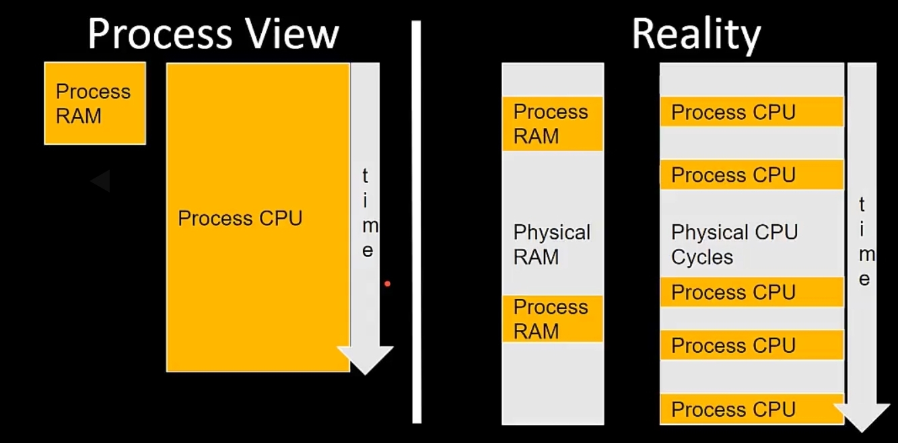

# Process and Threads

## Linux Processes

- Executable object code, running on hardware
  - elf(executable and linkable format)
- necessary resources to run are allocated and managed by the kernel through system calls
  - timers
  - files
  - hardware access
- referenced by PID(Process ID)
- Run on virtualized processor and virtualized view of memory
  - appears to software as its own dedicated RAM/CPU

## Virtual Processor/Memory

## Linux Thread

- Unit of activity within a process
- A process my be single-threaded or multithreaded
- Each thread has
  - stack -stores local variables
  - processor state/current location
- Memory address space is shared between threads

### Linux Threads / Processes and Memory

- Each Process has its own virtual memory
- Each Thread shares process virtual memory
- sharing memory access between threads
  - access directly( use sychronization)
- sharing memory access between processes?
  - use IPC(Inter-process Communitaction)

## Linux Signal

- One-way asynchronous notificiation sent from
  - Kernel to process
  - One process to another process(IPC)
  - A Process to itself
- processes setup signal handlers to control how to respond to a signal
  - example ctrl-c or SIGINT to stop a process
- Signal handlers must use signal safe functions which are safe to call asynchronously
  - use of global variables can introduce unsafe scenarios
  - process code can be interrupted at any time by signals

## Linux IPC(Interprocess Communication)

- allows process to exchange information without using a common global memory spaces.
  - pipes
  - semaphores
  - message queue
- shared memory