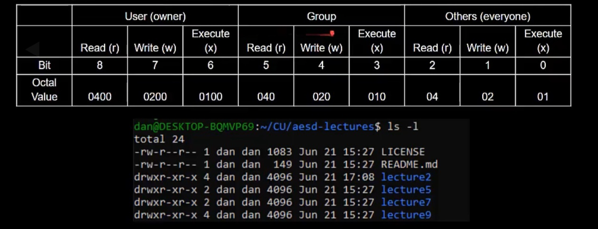

# Users and Groups

- user logs in with a username and password
  - authentication
- each user is associated with a user id(UID)
  - each process is associated with the uid of the user running the process
  - /etc/passwd  maps usernames uids
- uid 0 is the root user
  - can do almose anythings on the system
- each user belongs to on or more groups , with corresponding groups ids(gid)
  - /etc/group maps group names to gids

## Linux permissions

- Associates a file with owning user, owning group, and permission bits

