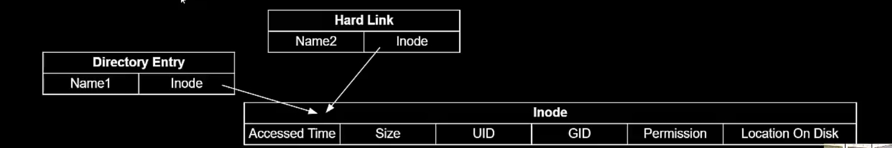
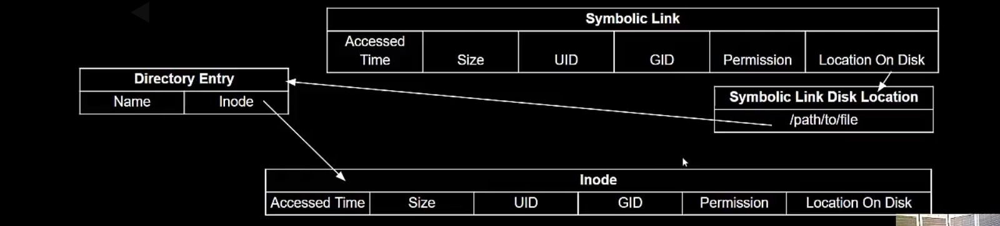

# Linux File System

## everything is a file

## file in linux

- /path/to/file - 절대경로
- path/to/file - 상대경로
- 맨 앞에 / 가 있어야 절대경로

## linux regular file properties

- bytes of data in a byte stream

## linux inode

- 디스크의 파일들을 트래킹할때 사용되는 메타데이터
- timestamp / owner / size / mode(access permission) / location
- fixed small 128 size
  - file name is not included

<table class="tg">
<thead>
  <tr>
    <th class="tg-0pky" colspan="6"> Inode </th>
  </tr>
</thead>
<tbody>
  <tr>
    <td class="tg-0pky">Accessed Time</td>
    <td class="tg-0pky">Size</td>
    <td class="tg-0pky">UID</td>
    <td class="tg-0pky">GID</td>
    <td class="tg-0pky">Permission</td>
    <td class="tg-0pky">Location on Disk</td>
  </tr>
</tbody>
</table>

## Linux Directories

- Map human readable name to inode numbers
- actually just file(with their own inodes)
- start at the root directory("/")

<table class="tg">
<thead>
  <tr>
    <th class="tg-0pky" colspan="2"> Directory Entry </th>
  </tr>
</thead>
<tbody>
  <tr>
    <td class="tg-0pky">Name1</td>
    <td class="tg-0pky">Inode</td>
  </tr>
</tbody>
</table>

<table class="tg">
<thead>
  <tr>
    <th class="tg-0pky" colspan="2"> Hard Link </th>
  </tr>
</thead>
<tbody>
  <tr>
    <td class="tg-0pky">Name2</td>
    <td class="tg-0pky">Inode</td>
  </tr>
</tbody>
</table>

### Why not inlcude filenames in Inodes?
- allows different file names to share the same content without duplicating inode contents
- the reason is the design to keep the filename out of the inode allows us to reference the file in multiple ways we can reference the same file content in multiple way

## Linux Links

- Flexibility of inode design means multiple names can resolve to the same inode.
- links redirect two file/directory paths to the same inode

- two types of links, hard and symbolic(symlinks)
  - hard links map directly to inodes, only allowed on the same file system
  - soft links map to file names, work across filesystems, can be broken

### Hard links

- can't span filesystems (inodes references a specific filesystem)
- conceptually the same as a directory entry.
- fiel deletes aren't allowed until all refereneces are deleted( preventing broken hard links)

### Symbolic Links(symlinks)

- Regular file with complete path in content
- can point anywhere, including ohter filesystems, can break

## Linux Special FIles

- Map Hardware devices to the everythings is a file paradigm
- kernel objects represented as files
  - character device
    - Linear queue of bytes
    - example: keyboard
  - block device
    - array of bytes, addressable in a sector
    - ie hard disk
  - named pipes / sockets
    - interproscess communication
  - 

## Linux filesystem

- collection of files in a hierarchy
- specific tyopes supported, tied to storage types
  - NFS - network file storage
  - ext4 - block device storage
  - fat - microsoft defined storage format for disks
- Mounted / Unmounted to add / remove from root filesystem
- smallest unit addressable is a block
  - block is a power of two mulitple of sector size
  - typical / histrorical sector size is 512 bytes.
  - ex) consider 1TB filesystem
    - 1000000000000 bytes.
    - 0x3b98cca00 bytes.
    - 34 bits required to address individually.
    - with 512 bytes blocks:
      - only 195312500(0x746a5288) blocks.
      - 30 bits required to access each block
    - with 4K blocks:
      - only 244140625(0xe8d4a51) blocks
      - 28 bits required to access each block.
